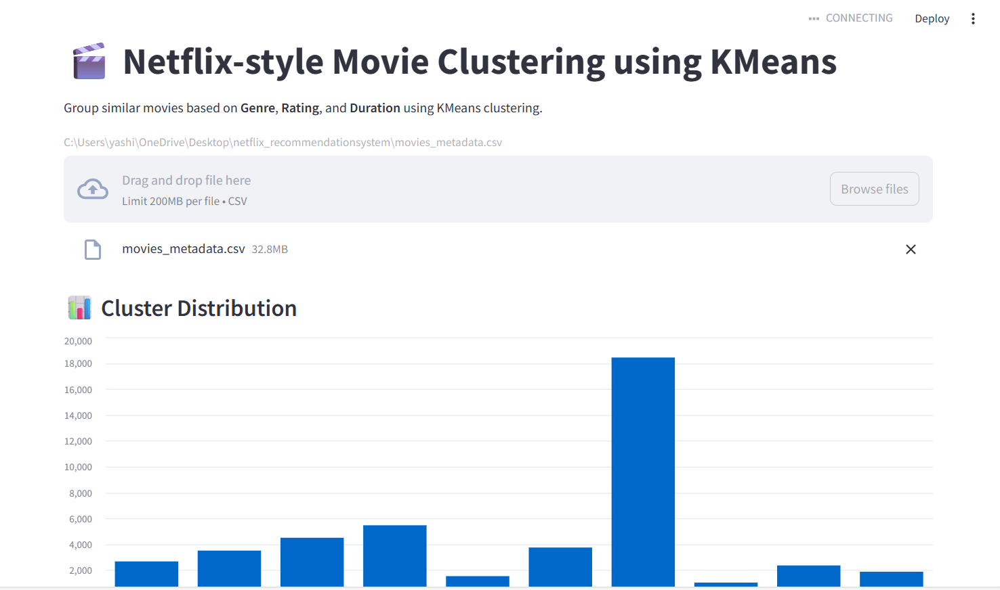
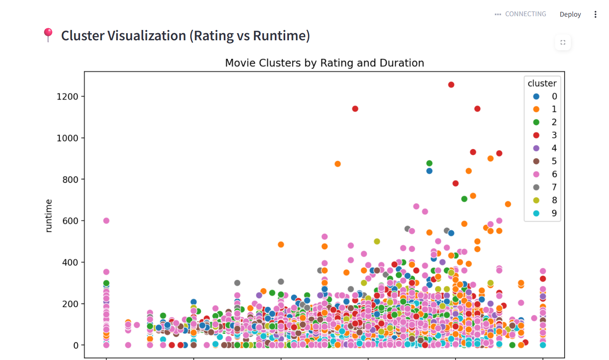
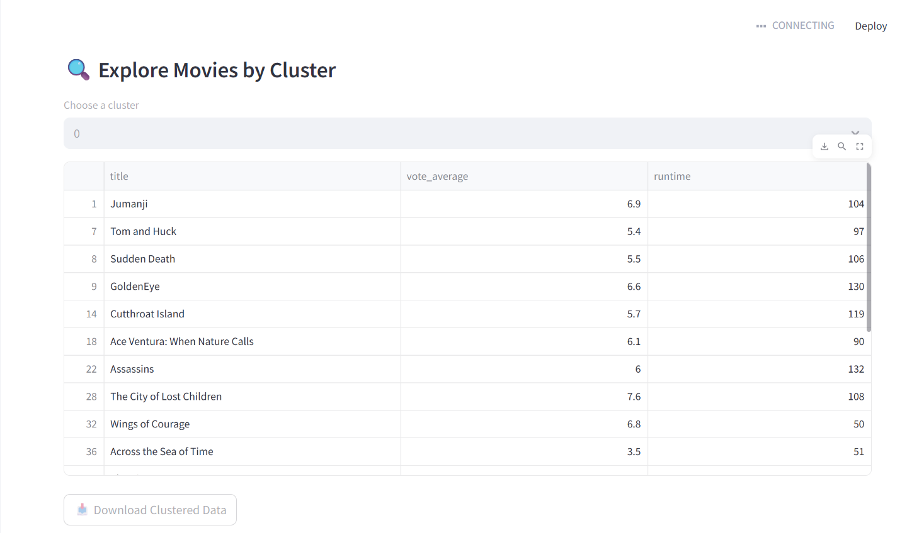
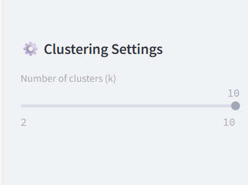

# 🎬 Netflix Show Clustering using K-Means

This project applies unsupervised learning (K-Means clustering) to group similar Netflix shows based on **genre**, **rating**, and **duration**. The goal is to explore content similarity and visualize natural clusters within the Netflix dataset.

---

## 📌 Features

- Cleaned and preprocessed real-world Netflix dataset
- One-hot encoding of categorical variables (`genre`, `rating`)
- Normalized `duration` for uniform scaling
- Elbow Method to find optimal number of clusters
- KMeans clustering on numerical features
- 2D visualization using PCA (Principal Component Analysis)
- Insightful cluster interpretation and show group analysis

---

## 📊 Technologies Used

- **Python**
- **Pandas** – for data preprocessing
- **Scikit-learn** – for scaling, clustering, PCA
- **Seaborn** & **Matplotlib** – for plotting and visualizations

---

## 🧠 Clustering Approach

1. **Data Cleaning**: Removed nulls, extracted duration as numeric, used first listed genre
2. **Encoding**: Applied one-hot encoding on genre and rating
3. **Scaling**: Standardized all numeric features
4. **K-Means**: Used elbow method to determine optimal clusters
5. **PCA**: Reduced dimensions to 2D for better visualization
6. **Interpretation**: Analyzed cluster properties to understand show groupings

---

## 📷 Output Screenshots

### 📌 Elbow Method - Optimal Clusters


### 📌 Clustered Shows (PCA 2D View)


### 📌 Dataset After Clustering


### 📌 Genre & Rating Distribution Per Cluster


---

## 📂 How to Run

```bash
# 1. Install required libraries
pip install pandas scikit-learn matplotlib seaborn streamlit

# 2. Run the Python script
streamlit app.py
